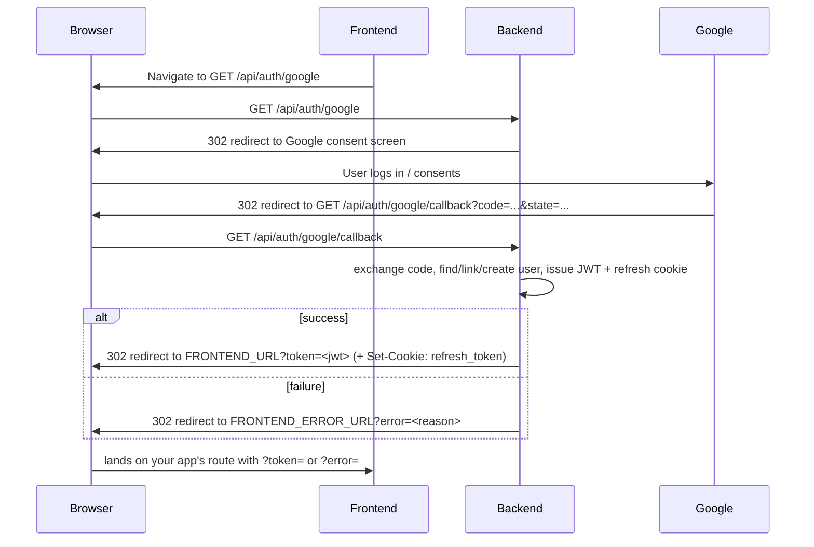

# Google Sign-In — Frontend Integration Guide

This document explains how "Sign in with Google" works on the backend and exactly what the frontend needs to implement to support it. It's a companion to the entries in [`api-contracts.md`](./api-contracts.md) — read that for the request/response reference; read this for the _flow_ and the steps to build against it.

## How it works (overview)

Google sign-in is a classic **OAuth2 redirect flow**, not an API call the frontend makes with `fetch`. The whole thing happens as full-page browser navigations:

The backend owns the entire exchange with Google. The frontend never talks to Google or to `/api/auth/google/callback` directly — it only needs to (1) kick off the flow and (2) handle landing back on its own page with a token or an error in the query string.

## Endpoints involved

| Method | Path                        | Called by                               | Notes                                                              |
| ------ | --------------------------- | --------------------------------------- | ------------------------------------------------------------------ |
| `GET`  | `/api/auth/google`          | Frontend (full navigation, not `fetch`) | Starts the flow. Optional `?invite_code=` query param — see below. |
| `GET`  | `/api/auth/google/callback` | Google (redirect)                       | Frontend never calls this directly.                                |

Both are public (no JWT required) — this is the entry point _into_ auth, so there's nothing to authenticate yet.

### Invite code (only for brand-new accounts)

Google sign-up is now gated by the same invite system as `POST /api/register`, but only for a **brand-new** account:

- If the Google email matches an existing account (password-based, auto-linked, or already Google-linked), no invite code is needed or checked — sign-in just proceeds.
- If there's no match, the backend needs a valid, unused invite code to create the account. Pass it as `GET /api/auth/google?invite_code=XXXXXXXXXXXXXXXX`.
- Missing or invalid invite code on a new-account sign-up surfaces as a normal error redirect to `FRONTEND_ERROR_URL?error=...` (see "Error reasons" below) — same as every other failure in this flow.
- The frontend doesn't need to know upfront whether a given Google account is new or existing — always send the invite code if the user has one (e.g. they came from an invite link); it's simply ignored if the account turns out to already exist.

Internally the invite code rides inside the same signed `state` param already used for CSRF protection — it never appears as its own field on the callback, so there's nothing extra for the frontend to read back.

## What the backend needs from you (config, not code)

Two URLs are configured **backend-side** as env vars — the frontend team needs to tell the backend team what these should be (or vice versa, whoever owns the env file):

| Env var              | Meaning                                                                                  |
| -------------------- | ---------------------------------------------------------------------------------------- |
| `FRONTEND_URL`       | Where the browser lands after a **successful** login, as `FRONTEND_URL?token=<jwt>`      |
| `FRONTEND_ERROR_URL` | Where the browser lands after a **failed** login, as `FRONTEND_ERROR_URL?error=<reason>` |

These should point at real routes in your app (e.g. `https://app.musicdiary.com/auth/callback` and `https://app.musicdiary.com/login`) that you build per the steps below. They don't have to be the same URL, but they can be if you'd rather branch on the presence of `token` vs `error` in one page.

## Steps for the frontend

1. **Add a "Sign in with Google" button/link.** It must be a real navigation, e.g. `<a href="https://api.yourapp.com/api/auth/google">` or `window.location.href = ...`. Do **not** call this endpoint with `fetch`/`axios`/XHR — it's a redirect chain through Google, which only works as a top-level browser navigation.

2. **Build (or confirm) the success-landing route** at whatever URL you gave the backend for `FRONTEND_URL`. On load, that page must:
   - Read `token` from the query string.
   - Store it exactly like the token from `POST /api/auth` today (same storage mechanism, same usage as `Authorization: Bearer <token>` on subsequent requests).
   - Strip `token` out of the URL (e.g. `history.replaceState`) so it doesn't linger in browser history, `Referer` headers, or get logged anywhere.
   - Redirect the user into the app (e.g. to the dashboard/home screen).
   - The `refresh_token` cookie is **already set** on this same redirect response by the backend (HttpOnly, Secure, `SameSite=Lax`) — no action needed here beyond what you already do for password login: send future requests with `credentials: 'include'` so `POST /api/token/refresh` keeps working.

3. **Build (or confirm) the error-landing route** at whatever URL you gave the backend for `FRONTEND_ERROR_URL`. On load, that page must:
   - Read `error` from the query string.
   - Show a generic failure message and a way back to the login screen (retry Google sign-in, or fall back to password login).
   - Treat `error`'s value as a **human-readable message for logging/debugging only** — don't branch app logic on its exact text (see "Error reasons" below).

4. **Treat the resulting JWT identically to a password-login JWT** — same 15-minute access-token lifetime, same refresh flow via `POST /api/token/refresh`, same logout via `POST /api/logout`. Google sign-in only changes _how the user authenticates the first time_; everything downstream (token storage, refresh, API calls) is unchanged.

5. **Test both landing pages independently of a real Google account** while building, by manually visiting:
   - `https://your-frontend/<success-route>?token=fake-token-value` — confirms storage + redirect-into-app logic.
   - `https://your-frontend/<error-route>?error=Something%20went%20wrong.` — confirms the error UI.

## Error reasons (informational only)

Current possible values of `?error=`, in case they're useful for debugging/logging — **not a stable API contract, don't pattern-match on these strings**.

Encoding is PHP `urlencode()` (space becomes `+`, not `%20`) — exact query string shown below for each case:

| Case                                                       | Raw message                                   | `?error=` as it appears in the URL                   |
| ---------------------------------------------------------- | --------------------------------------------- | ---------------------------------------------------- |
| Missing `code`/`state` query param on callback             | `Missing code or state.`                      | `?error=Missing+code+or+state.`                      |
| State expired/tampered, or replayed stale link             | `Invalid or expired OAuth state.`             | `?error=Invalid+or+expired+OAuth+state.`             |
| Google account has no email                                | `Google account has no email.`                | `?error=Google+account+has+no+email.`                |
| Unexpected access token type from Google                   | `Unexpected access token type from Google.`   | `?error=Unexpected+access+token+type+from+Google.`   |
| Unexpected resource owner type from Google                 | `Unexpected resource owner type from Google.` | `?error=Unexpected+resource+owner+type+from+Google.` |
| New account, no `invite_code` passed to `/api/auth/google` | `Invite code required.`                       | `?error=Invite+code+required.`                       |
| New account, invite code unknown or already used           | `Invalid invite code.`                        | `?error=Invalid+invite+code.`                        |

Full redirect looks like `FRONTEND_ERROR_URL?error=Invalid+invite+code.` — parse with a standard query-string parser (e.g. `URLSearchParams`), which decodes `+` back to space automatically; don't string-match on the raw encoded form.

## Account behavior (context, no frontend action needed)

- If the Google email matches an existing password-based account, it's automatically linked (same account, now usable via either method) — the user doesn't see anything different.
- If there's no match, a brand-new account is created with no password — this now requires a valid invite code (see "Invite code" above), same gate as `POST /api/register`.
- There's no separate "Google account" indicator anywhere in the API today — a linked/Google-only user looks like any other `GET /api/user` response.

## Checklist

- [ ] "Sign in with Google" is a real navigation (`<a href>` or `location.href`), not a fetch call
- [ ] Success-landing route reads `?token=`, stores it, strips it from the URL, redirects into the app
- [ ] Error-landing route reads `?error=`, shows a generic failure message, offers retry
- [ ] Confirmed `FRONTEND_URL` / `FRONTEND_ERROR_URL` values with backend match your actual routes
- [ ] Verified `credentials: 'include'` is already set for API calls (needed for `refresh_token` cookie, same as password login)
